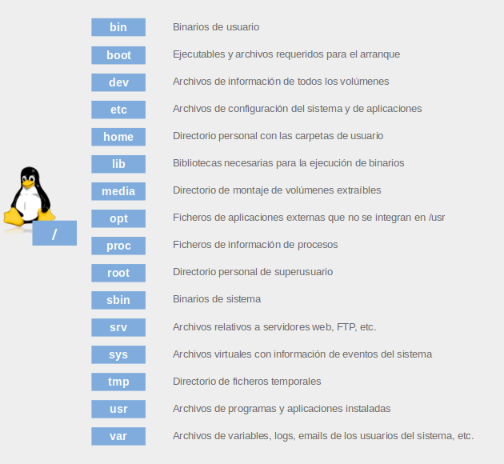

## Directorios



## Comandos

```bash
Clear # limpieza de terminal.
Exit # salir.
Reboot # reinicia el ordenador.
Control+c # reinicia la entrada.
Control+z # stop.
pwd # te dice el directorio actual.
~$ sudo apt-get install [lo que intalas]
#Donde estamos: lucas:~$
lucas # es el usuario con el que iniciamos sesión.
~ # indica que estamos en el directorio home/lucas
$ # indica que estamos con un usuario normal, no root.
# (#) si estuviéramos como superusuario root (usuario administrador).
```

### Ayudas del shell

```bash
[nombre_comando] - -help
info [nombre_comando]
man [nombre_comando] # manual completo, si solo ponemos man, aparecen todos.
apropos [nombre_comando] # da comandos relacionados con el introducido.
```

### Metacaracteres

- [] -> rangos y condicionales.
- | -> para poner mas comandos en una misma linea.
- > sistituye de 0-N caracteres.
- ? -> sistituye de 1-N caracteres, es decir, si solo hay un archivo que es 'd' y haces d? no lo coje.
- $ -> x$ Una línea que acaba en x.
- ^ ó ! -> negacion.
- ^ -> tambien es el princio de linea.
- Expresiones regulares -> caracteres que son un patrón de búsqueda (cadenas de caracteres).

### Comandos básicos

- Comandos para manipular ficheros y directorios
- Comando open -> abre el fichero.
- Comando ls -> lista el contenido.
- Comando cd -> cambia de directorio, cd .. va hacia atras.
- Comando pwd -> directorio actual.
- Comando mkdir -> crea directorios.
- Comando rmdir -> elimina directorios.
- Comando mv -> mover fichero/s a otros directorios y puede renonbrarlos.
- Comando cp -> copia fichero/s a otros directorios.
- Comando short -> ordena firechos/ nombres.
- Comando touch -> crea un fichero vacio.
- Comando rm -> borra (desenlaza) ficheros.
- Comando chgrp -> cambia de grupo al fichero.
- Comando chown -> cambia de dueño y de grupo al fichero.
- Comando df -> espacio disponible en volumen del disco.
- Comando free -> consumo de memoria del sistema.
- Comando alias -> asigna otros nombres a los comandos.
- Comando type -> interpreta el bash una orden, si es comando muestra el camino (path), un alias el comando original y para una función su código.
- Comando diff -> compara ficheros línea a línea, y muestra las líneas que cambian.
- Comando du -> la longitud (en kilobytes por defecto) de una jerarquía de ficheros.
- Comando chmod -> cambia los permisos del fichero (r,w,x).
- Comando echo -> imprime mensaje en la pantalla.
- Comando ee -> editor de textos muy simple.
- Comando find -> busca de forma recursiva en un directorio a todos los ficheros que cumplan ciertas condiciones.

### Comandos para paginar, visualizar y editar ficheros .

- Comando cat -> concatena ficheros y los imprime en la salida estándar.
- Comando zcat -> igual a cat pero con archivos comprimidos.
- Editor vi -> editor con comandos (unix), version conocida es vim.
- Editor nano -> editor de ficheros.
- Comandos more y less -> paginan (dividen en páginas) uno o varios ficheros y los muestran en terminal.
- Comando file -> el tipo de un fichero.
- Comando stat -> muestra las características de un fichero.

### Comandos para hacer búsquedas de ficheros y patrones

- Comando grep -> busca patrones en ficheros, si no pones nada hace busqueda por la salida estandar(filtra).
- Comando locate -> busca en una base de datos, actualizada periódicamente, todos los paths en la jerarquía de ficheros que contengan una cadena determinada.

### Comandos para filtrar ficheros

- Comando sort -> ordena lineas de un fichero.
- Comando uniq -> elimina las líneas repetidas de un fichero ordenado.
- Comandos tail y head -> muestran el final y el comienzo (10 líneas) de ficheros.
- Comando wc -> imprime el número de líneas, palabras y bytes de ficheros, si son varios un resumen ambos.
- Comando cut -> corta una línea de texto, para obtener un subconjunto en lugar de la línea completa.
- Comando awk -> lenguaje de programación, de análisis y procesamiento. Es mezcla de grep y sed.

### Comandos para compactar y agrupar ficheros

- Comando tar -> agrupa varios ficheros aislados o el contenido de un directorio en otro fichero o dispositivo especial.
- Comando gzip y gunzip -> comprime o descomprime ficheros.

### Comandos para administrar usuarios y grupos

- Comando sudo -> orden root superusuario.
- Comando useradd -> crea usuarios con info por defecto.
- Comando groupadd -> crea grupos con info por defecto.
- Comando adduser -> crea usuario configurable.
- Comando addgroup -> crea un grupo de users.
- Comando userdel -> elimina un usuario.
- Comando groupdel -> elimina un grupo.
- Comando passwd -> cambia el password de un usuario, bloquear, desbloquear o deshabilitar una cuenta.
- Comando usermod -> modifica el usuario (login, directorio base, shell, grupos perteneciente, fecha de expiración de la cuenta), bloquea y desbloquea una cuenta.
- Comando chfn -> cambiar la información de contacto del usuario.
- Comando gpasswd -> administra los grupos, añadir y elimina usuarios, nombra administrador y pone password de grupo.
- Comando su -> cambiaa de usuario en la terminal, se usa son sudo.
- Comando id -> identifica al usuario con su grupo principal y el resto de grupos al que pertenece.
- Comando chage -> caducidad de contraseñas.
- Comando last -> ultimas conexiones del usuario.
- Comando write -> envia un mensaje a un usuario.
- Comando wall -> envia un mensaje a todos los usuarios (habilitar el recibirlos).

### Comandos de gestion de discos

- Directorio /dev -> contiene archivos de hardware, interactua con los dispositivos, como discos duros.
- Comando GParted -> herramienta gráfica que permite gestionar, crear, eliminar, redimensionar, mover y copiar las particiones.
- Comando gdisk -> puedes convertir un disco GPT (Tabla de particiones GUID) a MBR (Tabla de particiones maestra).
- Comando fdisk -> gestionar las particiones con -l las listas.
- Comando df -> muestra el espacio de almacenamiento disponible.
- Comando du -> muestra el uso del espacio en disco de los archivos y directorios.
- Comando mkfs -> formatea particion.
- Comando mount, unmount, /etc fstab -> para asociar/desasociar (por defecto con fstab) un sistema de archivos ubicado en una partición específica con un directorio
- Nombrar discos -> sd$x, sd(tipo de disco), $(letra), x(nº particion)-> sdb3.
- Particiones -> 3 primarias, 1 extendida (15-23 lógicas).

### Comandos de gestion de procesos

- Comando ps -> visualizar la información sobre los procesos.
- Comando pstree -> muestra la estructura jerárquica entre procesos.
- Comando kill -> envio de señales a un proceso. En general señal de FIN.
- Comando top -> muestra información en tiempo real de los procesos.
- Comando nice -> permite ejecutar un proceso con una prioridad definida por el usuario.
- Comando Time -> muestra los tiempos de ejecución de un comando.

### Comandos de gestion del tiempo

- Comando at -> ejecuta comando a una hora especifica.
- Comando atq -> enumera los trabajos pendientes de los usuarios.
- Comando atrm -> borra trabajos por su número [1.de](http://1.de/) trabajo.
- Comando cron -> demonio(proceso en segundo plano), que ejecuta programas o scripts en tiempo y periodicidad especifica.
- Comando crontab -> cada usuario tiene archivo crontab y sólo el usuario root puede modificarlos.

### Tuberias

- Lista el contenido de /home/alumno con sus permisos y filtra todos los ficheros para los que algun usuario o grupo tienen permisos (RWX).
    
    ```bash
    ls -l /home/lucas | grep rwx
    ```
    
- Concatenar /etc/passwd y /etc/group filtrar las lineas que contengan alumno y contarlas.
    
    ```bash
    cat /etc/passwd /etc/group | grep lucas | wc -l
    ```
    
- Lista /sbin y mostar las que contengan " mk".
    
    ```bash
    ls -s /sbin | grep mk
    ```
    
- Del archivo codigos.txt, filtra los que contengan "45" no queremos lineas repetidas.
    
    ```bash
    grep "45" codigo.txt | sort | unique
    # short ordena los nombres para que con el unique borre los repetidos, sino no borra todos.
    ```
    
- Cuántos ficheros hay en el directorio actual?.
    
    ```bash
    ls | wc -l
    ```
    
- Cuenta el número de directorios que hay en el directorio actual.
    
    ```bash
    ls -l | grep ^d | wc -l
    ```
    
- Usando las órdenes who, sort, uniq y cut indica los usuarios que están trabajando en el sistema en este momento, el listado se muestra ordenado.
    
    ```bash
    cut -f1 -d “ “ | sort | uniq
    ```
    
- ¿Cuál es la diferencia.
    
    ```bash
    sort -u FILE
    ```
    
    ```bash
    sort FILE | uniq
    ```
    
- Obtener un listado de los ficheros del directorio actual, ordenado por tamaño de archivo.
    
    ```bash
    ls -l | sort +4n
    ```
    

## Scripts

- nano calculadora (editor).
- bash calculadora (ejecutar).
- #!/bin/bash -> le decimos al interprete que interprete lenguaje bash, tambien se podria hacer con python.

```bash
$0 -> nombre del script.
$n -> parámetro N.
$# -> número de parámetros recibidos.
$* -> lista de todos los argumentos.
$$ -> identificador del proceso actual.
$! -> identificador del último proceso invocado.
$? -> identificador del último proceso ejecutado.
$@ -> todos los parámetros recibidos.
```

```bash
! -> NOT.
&& , -a -> AND.
|| , -o -> OR.
```

```bash
numero1 –eq numero2 -> numero1 igual que numero2.
numero1 –ne numero2 -> numero1 distinto que numero2.
numero1 –lt numero2 -> numero1 menor que numero2.
numero1 –le numero2 -> numero1 menor o igual que numero2.
numero1 –gt numero2 -> numero1 mayor que numero2.
numero1 –ge numero2 -> numero1 mayor o igual que numero2.
```

```bash
cadena = cadena2 -> igualar cadena.
cadena == cadena2 -> comparar cadena(igual).
cadena != cadena2 -> comparar cadena(distinto).
```

```bash
e fichero -> existe.
-s fichero -> no está vacío.
-f fichero -> es fichero.
-d fichero -> es directorio.
-h fichero -> enlace simbólico.
-r fichero -> permiso de lectura.
-w fichero -> permiso de escritura.
-x fichero -> permiso de ejecución.
-O fichero -> propietario.
-G fichero -> pertenece al grupo.
-n cadena -> no vacia.
-z cadena -> vacia.
```

```bash
shift -> para ir borrando los parametros en cada iteracion.
```