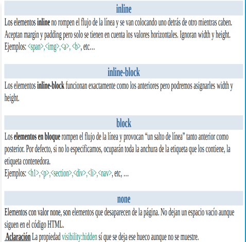

# CSS
- El CSS se puede hacer en el head, en el body y en un archivo a parte conectado en el head (la mejor opción)(tambien se puede importar la url, pero es lo mismo).

### Class e ID

- En el HTML no pueden ir elementos con mismo ID(#) pero con CLASS(.) puede haber varios.

### Etiquetas semanticas (SEO)

- **header.**
- **nav (zona de navegacion).**
- **aside (barra lateral).**
- **main.**
- **article.**
- **section.**
- **footer**.

## Maquetación

### Display



### Layout

- **Fixed-px:** puedes cambiar el tamaño en pixeles.
- **Elactic-em:** escala el texto con el zoom, normalmente 16px.
- **Fluid-%:** establece el ancho de los distintos contedores respecto al padre.

- Para que funcionen bien las cajas con su relleno y borde usar:
    - Modelo **content-box** (navegador por defecto).
        - width + padding + border
    - Modelo **border-box**:
        - El width incluye el paddign y el border


```css
    html{
        -webkit-box-sizing: border-box;
        -moz-box-sizing: border-box;
        box-sizing: border-box;
    }
    
    *,*::before,*::after{
        -webkit-box-sizing: inherit;
        -moz-box-sizing: inherit;
        box-sizing: inherit;
    }
```

## Posicionamiento

- **position: static**: es el valor por defecto. El elemento sigue el flujo que le corresponde. Aunque use top, bottom, left, right o z-index al elemento no se aplica ningún desplazamiento.
- **position: absolute**: la referencia de coordenadas dependerá del contenedor padre (el primer padre que no sea estático).
- **position: relative**: Como static, pero permite aplicar las propiedades: left, top, right,botton. A partir de la posición que le corresponde, se le aplica las propiedades top, left y right. Puede provocar solapamientos.
- **position: sticky**: Se comporta como relative hasta llegar a una posición de scroll y a partir de entonces fixed (hay que ponerle top:0).
- **Float:** (rigth, left): es la más potente, si haces cajas dentro de contenedores, hay que ponerle ancho y altura y saberse bien los comportamientos de cada elemento.

En la caja contenedor padre hay que poner un **position: relative** y en la hija **position: absolute y estas propiedades:**

1. top:0, left:0
2. top:0, right:0
3. bottom:0, left:0
4. bottom:0, right:0
5. center


## Imágenes como DIV

```css
.caja {
  width: 300px;         /* Ancho de la caja */
  height: 200px;        /* Alto de la caja */
  background-image: url('ruta');  /* URL de la imagen */
  background-repeat: no-repeat;  /* No repetir la imagen */
  background-size: cover;       /* La imagen cubre toda el área de la caja */
  background-position: center;  /* Centra la imagen en la caja */
}

```