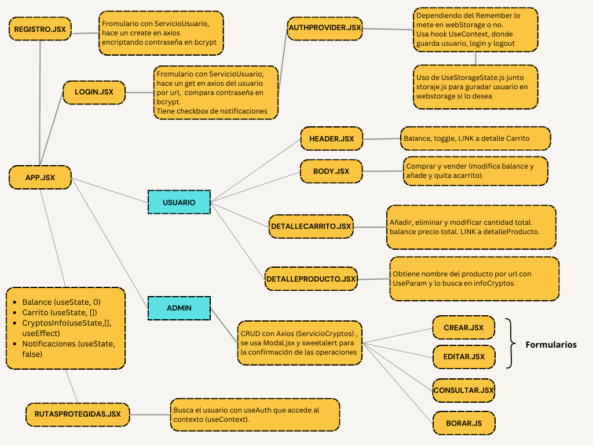

# NextMarket

### 1. Nombre del proyecto:

**NextMarket**

El nombre refleja la funcionalidad principal de la aplicación, que es un carrito a modo de exchange de criptomonedas, permitiendo a los usuarios comprar y vender diversas criptomonedas de manera sencilla e intuitiva.

### 2. Descripción de la funcionalidad:

**Descripción general:**

**NextMarket** es una aplicación web diseñada para facilitar la compra y venta de criptomonedas a través de una interfaz de usuario intuitiva. Permite a los usuarios registrarse, iniciar sesión y gestionar sus compras de criptomonedas.

**Acciones principales que los usuarios podrán realizar:**

- **Login:** Los usuarios pueden iniciar sesión en su cuenta y optar por recordar su sesión para futuras visitas en webStorage. También tienen la opción de permitir notificaciones para recibir alertas cuando compran.
- **Registro:** Los nuevos usuarios pueden registrarse mediante un formulario, validando su información y registrar los cambios en la “base de datos” a través de peticiones Axios a la API JsonServer.
- **Modo Usuario:**
    - Acceso a un carrito donde pueden realizar compras y ventas de criptomonedas.
    - Acceso protegido mediante rutas protegidas.
    - Visualización de un balance actualizado en el encabezado de la página.
    - Un toggle que permite ver los productos comprados y su estado.
    - Un resumen del carrito donde se presentan los detalles de la compra.
    - Detalles del producto, con información sobre cada criptomoneda.
    - Posiblidad de cerrar sesión borrando los datos del navegador.
    - Notificaciones instantáneas utilizando Toastify para informar sobre acciones realizadas.
- **Modo Admin:**
    - Funcionalidades para añadir, consultar, editar y eliminar criptomonedas de la “base de datos” de la API JsonServer , a través de Axios.

### **3. Conceptos de Clase a Utilizar**

**Manejo del Estado y React Hooks**

- **`useState`**: Se emplea para gestionar el estado local de los componentes, como el almacenamiento del balance, el estado del carrito y la visibilidad de ciertos elementos de la página.
- **`useEffect`**: Se utilizará para manejar efectos secundarios, como la obtención de datos desde la API, la actualización del estado según cambios en la aplicación y la suscripción a eventos.
- **`useContext` con AuthProvider**: Se implementará un contexto de autenticación (`AuthProvider`) para manejar el estado global del usuario, permitiendo que la información de autenticación esté disponible en toda la aplicación.
- **`useStorageState`**: Se emplea para gestionar el almacenamiento en `localStorage` y `sessionStorage`, lo que permitirá recordar sesiones activas y guardar información en l navegador.
- **`useParams`**: Se utiliza para manejar rutas dinámicas en la aplicación, permitiendo acceder a los detalles de cada criptomoneda recibiendo el nombre identiicador por la URL.

---

**Gestión de Rutas y Autenticación**

- **React Router**: Se emplea para la navegación entre las diferentes vistas de la aplicación, permitiendo la estructuración de rutas sin tener que recargar la página y aumentando el rendimiento.
- **Rutas protegidas** : Para que solo los usuarios autenticados puedan acceder a ciertas secciones, evitando el acceso a información sin permisos adecuados.
- Tanto el Login como el Registro encriptan las contraseñas con la librería `bcrypt`.
- **`Navigate` y `useNavigate`**: Se empleará para redireccionar a los usuarios según su estado de autenticación, evitando accesos no autorizados.
- **Dinamización de rutas**: Se utilizarán parámetros en las rutas (`/producto/:id`) para acceder a los detalles de cada criptomoneda.

---

**Manejo de Datos y Comunicación con el Backend**

- **Axios**: Se emplea para realizar peticiones HTTP a la API, facilitando la autenticación de usuarios, la gestión de productos y las transacciones dentro de la plataforma.
- **Consumo de API con JsonServer**: Se usará `JsonServer` como base de datos simulada para manejar la persistencia de los productos y usuarios, permitiendo realizar las operaciones `GET`, `POST`, `PUT` y `DELETE`.
- **CRUD de criptomonedas**: Los administradores podrán crear, consultar, actualizar y eliminar criptomonedas mediante peticiones HTTP gestionadas con Axios.
- **Manejo de respuestas y errores**: Se implementarán validaciones en las peticiones y muestra mensajes de error adecuados al usuario.

---

**Funcionalidades UX**

- **Toggle de productos comprados**: Se añadirá un interruptor (`toggle`) para que los usuarios puedan visualizar de manera rápida los productos adquiridos en su historial de compras.
- **Resumen del carrito**: Se muestra un resumen interactivo con detalles de las compras realizadas.
- **Mensajes de error y validaciones**: Se implementarán validaciones en los formularios y alertas visuales para mejorar la usabilidad y evitar errores en el ingreso de datos.
- **SweetAlert para confirmaciones y alertas**: Se utilizará **SweetAlert** para mostrar mensajes de confirmación antes de realizar acciones importantes, como el CRUD del ADMIN.

---

### **4. Conceptos No Vistos en Clase a Utilizar:**

**Estilización y Diseño Responsivo (UI)**

- **Tailwind CSS**: Se utiliza para unos estilos visuales y modernos de la aplicación.
- **Diseño responsive**: La aplicación se adaptará a diferentes dispositivos usando clases de Tailwind (`flex`, `grid`, `md:`, `lg:`, etc.).

**Justificación de uso:** Tailwind CSS es un framework que permite desarrollar interfaces de usuario rápidas y responsivas sin necesidad de escribir hojas de estilo CSS personalizadas.

---

**Experiencia de Usuario (UX) Mejorada**

- **Toastify para notificaciones**: Se utiliza para mostrar alertas instantáneas sobre acciones realizadas, como compras exitosas.
    - **Justificación de uso:** Permite mostrar notificaciones emergentes en la interfaz de usuario.
- **Lucide Icons para interactividad**: Se integra la librería de iconos `Lucide` para mejorar la navegación y la experiencia visual de los usuarios, haciendo que la interfaz sea más intuitiva.
    - **Justificación de uso:** Lucide es una librería de iconos basada en Feather Icons, que proporciona una amplia variedad de íconos personalizables para mejorar la interfaz de usuario.

---

### 5. Diagrama de la App

---

### 6. Flujo de pruebas

1. Hacer Registro y comprobar data.json.
2. Hacer login recordando y sin recordar sesion (pulsando F5).
    1. Hacer logout.
3. Permitir y no permitir notificaciones.
4. Probar comprar y vender cryptomonedas.
    1. Revisar toggle.
    2. Ver detalle carrito.
        1. Sumar, restar y elegir cantidad.
        2. Ver detalle producto.
5. Meterse en Admin
    1. Consultar, eliminar, añadir, editar → comprobar data.json y en la app.