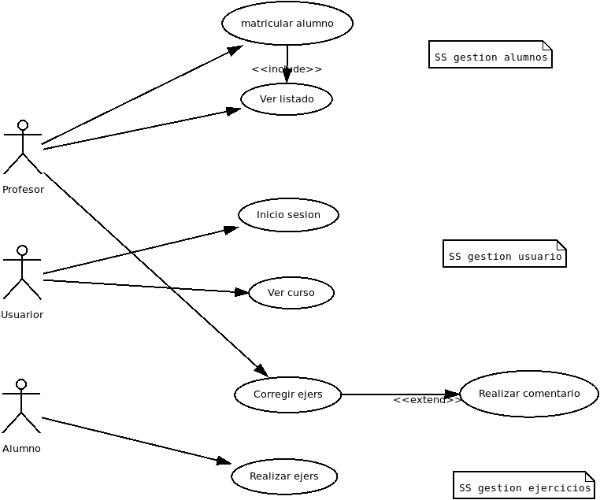

# Casos de uso = Funcionalidad.

1. Caso de uso: Describe las interacciones entre el sistema y los actores (usuarios o sistemas externos).
2. Modelaje: Consiste en identificar actores, casos de uso y describirlos en detalle. Luego, se crea un diagrama visualizar las interacciones.
3. Actor: Es cualquier entidad externa que interactúa con el sistema y se representa en los diagramas de casos de uso.

## Pasos para hacerlo:

1. ¿Cual es la funcion del sistema software? (Objetivos del sistema)
2. ¿En que consiste el sistema? (subobjetivos)
3. ¿Cuales son los actores que interactuan con el sistema?

ej: Aula virtual

1. Gestionar aula virtual.
2. gestionar alumnos, gestionar ejercicios, gestionar cursos.
3. Alumnos, profesores.

