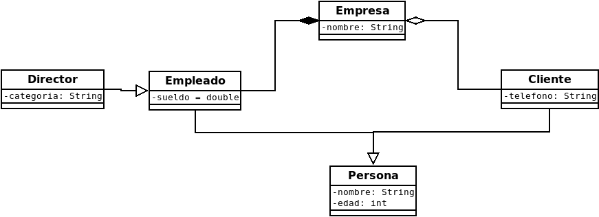
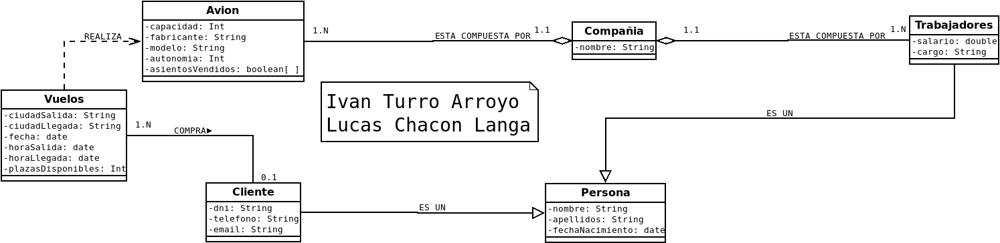

# Diagrama de clases UML: Estandar de facto (DISEÑO)

- Elementos:
    
    - Clase: estatico
    
    - Atributos:
    
    - Privado: encapsulado, se accede mediante getter.
    
    + Publico: constantes.
    
    ## Protegidos: puden acceder clases hijas.
    
    -Metodos.
    
    - Objetos: son una instancia que tienen atributo y valor.
    
- Relaciones entre clases:
    - Asociacion:
        - Agregacion: No hay dependencia.
        - Composicion: Si hay dependencia.
    - Herencia (Es un, Is a)(Generalizacion y especializacion):
        - Simple: clase con 1 padre.
        - Multiple: clase con varios padres.
        - Pseudomultiple: interzaces.
        - Dependencia o uso (normalmente el main)(fuertemente acoplado)
- Relaciones segun nº de clases que relaciona:
    - Reflexivas: padre e hijo: Clase persona con atributos de tipo persona.
    - Binarias.
    - Narias.
    
    Cardinalidad:
    1: Persona que nace en 1 pais.
    0-1: Empleado que tiene 1 jefe o 0.
    0-*: Persona que tiene una propiedad, varias o ninguna.
    1-*: Alumno con 1 o mas asignaturas, sino no es alumno.
    nº exacto: Un segmento tiene dos puntos.

